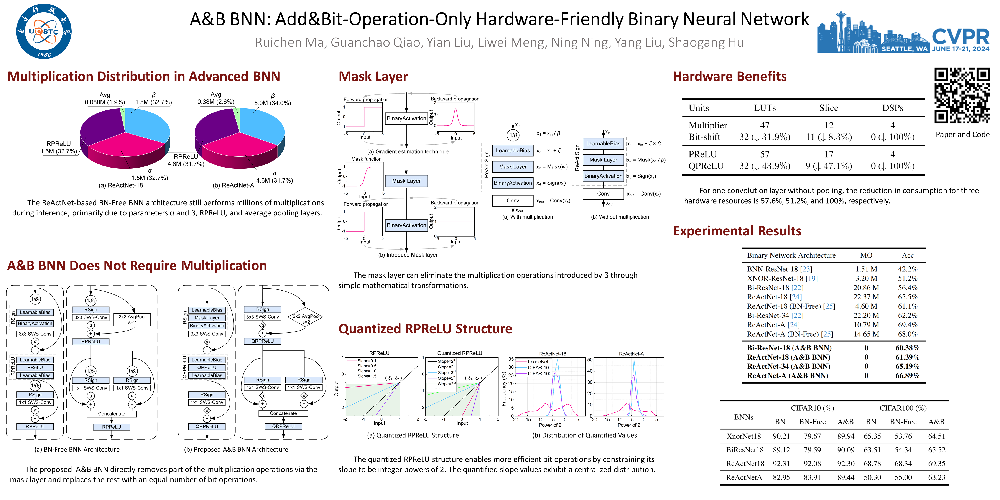

# AB-BNN
This is the offical pytorch implementation of paper **A&B BNN: Add&Bit-Operation-Only Hardware-Friendly Binary Neural Network** published in CVPR 2024.



Paper Link: &emsp;
[Arxiv](https://arxiv.org/abs/2403.03739)&ensp;
[CVPR](https://cvpr.thecvf.com/virtual/2024/poster/29447)&ensp;
[Google Scholar](https://scholar.google.com/scholar?cluster=9219398500921383941)&ensp;
[IEEE](https://xploreqa.ieee.org/document/10656026)  
Video Link: &emsp;
[Bilibili](https://www.bilibili.com/video/BV1PM4m1S7T1)&ensp;
[YouTube](https://youtu.be/L8cWTetcU2M?si=V_fH1YXVKhlaEdf4)

## Abstract
Binary neural networks utilize 1-bit quantized weights and activations to reduce both the model's storage demands and computational burden.
However, advanced binary architectures still incorporate millions of inefficient and nonhardware-friendly full-precision multiplication operations.
A&B BNN is proposed to directly remove part of the multiplication operations in a traditional BNN and replace the rest with an equal number of bit operations, introducing the mask layer and the quantized RPReLU structure based on the normalizer-free network architecture.
The mask layer can be removed during inference by leveraging the intrinsic characteristics of BNN with straightforward mathematical transformations to avoid the associated multiplication operations.
The quantized RPReLU structure enables more efficient bit operations by constraining its slope to be integer powers of 2.
Experimental results achieved 92.30%, 69.35%, and 66.89% on the CIFAR-10, CIFAR-100, and ImageNet datasets, respectively, which are competitive with the state-of-the-art.
Ablation studies have verified the efficacy of the quantized RPReLU structure, leading to a 1.14% enhancement on the ImageNet compared to using a fixed slope RLeakyReLU.
The proposed add&bit-operation-only BNN offers an innovative approach for hardware-friendly network architecture.

## Citation
If you find our code useful for your research, please consider citing:

```
@InProceedings{Ma_2024_CVPR,
    author    = {Ma, Ruichen and Qiao, Guanchao and Liu, Yian and Meng, Liwei and Ning, Ning and Liu, Yang and Hu, Shaogang},
    title     = {A\&B BNN: Add\&Bit-Operation-Only Hardware-Friendly Binary Neural Network},
    booktitle = {Proceedings of the IEEE/CVF Conference on Computer Vision and Pattern Recognition (CVPR)},
    month     = {June},
    year      = {2024},
    pages     = {5704-5713}
}
```

## Requirements
- python==3.8
- pytorch==2.0.1

## Pre-trained Model
The pre-trained models can be downloaded at [Baidu Netdisk](https://pan.baidu.com/s/1CiYtPZuUaIk99WM6umOk9Q?pwd=abnn) (pwd=abnn), and the codes for inference can be found in [./Inference](https://github.com/Ruichen0424/AB-BNN/tree/master/Inference).
The following code can be used to check the md5 values ​​of all files.
```
md5sum -c md5.txt
```

## Main Results
<table>

<tr>
<th>Dataset</th>
<th align="right">Structure</th>
<th align="center"># Params</th>
<th align="center">Top-1 Acc</th>
<th align="center">Downloadable</th>
</tr>

<tr>
<th rowspan=2>CIFAR10</th>
<td align="center">ReActNet-18</td>
<td align="center">11.18 M</td>
<td align="center">91.94%</td>
<td align="center">&#x2714</td>
</tr>
<tr>
<td align="center">ReActNet-A</td>
<td align="center">28.32 M</td>
<td align="center">89.44%</td>
<td align="center">&#x2714</td>
</tr>

<tr>
<th rowspan=2>CIFAR100</th>
<td align="center">ReActNet-18</td>
<td align="center">11.23 M</td>
<td align="center">69.35%</td>
<td align="center">&#x2714</td>
</tr>
<tr>
<td align="center">ReActNet-A</td>
<td align="center">28.41 M</td>
<td align="center">63.23%</td>
<td align="center">&#x2714</td>
</tr>

<tr>
<th rowspan=3>ImageNet</th>
<td align="center">ReActNet-18</td>
<td align="center">11.70 M</td>
<td align="center">61.39%</td>
<td align="center">&#x2714</td>
</tr>
<tr>
<td align="center">ReActNet-34</td>
<td align="center">21.82 M</td>
<td align="center">65.19%</td>
<td align="center">&#x2714</td>
</tr>
<tr>
<td align="center">ReActNet-A</td>
<td align="center">29.33 M</td>
<td align="center">66.89%</td>
<td align="center">&#x2714</td>
</tr>

</table>