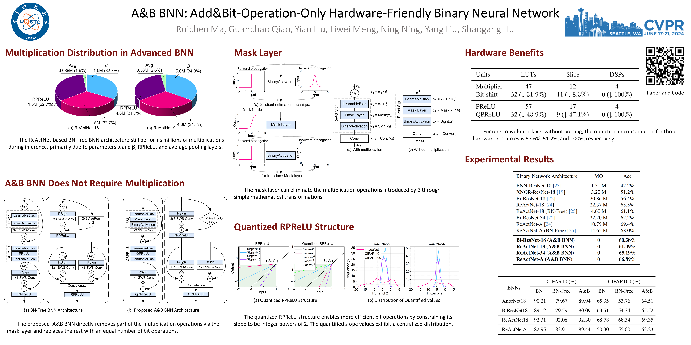

<div align="center">

<h1>A&B BNN: Add&Bit-Operation-Only Hardware-Friendly Binary Neural Network</h1>

<!-- Badges -->
[](https://arxiv.org/abs/2403.03739)
[](https://cvpr.thecvf.com/virtual/2024/poster/29447)
[](https://scholar.google.com/scholar?cluster=9219398500921383941)
[](https://xploreqa.ieee.org/document/10656026)
[](https://huggingface.co/Ruichen0424/AB-BNN)

</div>

<br>

## 🚀 Introduction

This is the official PyTorch implementation of the paper **A&B BNN: Add&Bit-Operation-Only Hardware-Friendly Binary Neural Network**, published in **CVPR 2024**.



**Video Links:**

[](https://youtu.be/L8cWTetcU2M?si=V_fH1YXVKhlaEdf4)
[](https://www.bilibili.com/video/BV1PM4m1S7T1)

## 📄 Abstract
Binary neural networks utilize 1-bit quantized weights and activations to reduce both the model's storage demands and computational burden.
However, advanced binary architectures still incorporate millions of inefficient and non-hardware-friendly full-precision multiplication operations.
A&B BNN is proposed to directly remove part of the multiplication operations in a traditional BNN and replace the rest with an equal number of bit operations, introducing the mask layer and the quantized RPReLU structure based on the normalizer-free network architecture.
The mask layer can be removed during inference by leveraging the intrinsic characteristics of BNN with straightforward mathematical transformations to avoid the associated multiplication operations.
The quantized RPReLU structure enables more efficient bit operations by constraining its slope to be integer powers of 2.
Experimental results achieved 92.30%, 69.35%, and 66.89% on the CIFAR-10, CIFAR-100, and ImageNet datasets, respectively, which are competitive with the state-of-the-art.
Ablation studies have verified the efficacy of the quantized RPReLU structure, leading to a 1.14% enhancement on the ImageNet compared to using a fixed slope RLeakyReLU.
The proposed add&bit-operation-only BNN offers an innovative approach for hardware-friendly network architecture.

## 🛠️ Requirements
- python==3.8
- pytorch==2.0.1

## 💻 Usage

### Network Architecture
The network definitions are located in the [`./Network`](./Network) directory.

### Training
We provide training scripts for both CIFAR and ImageNet datasets. The training process is divided into two steps.
- **CIFAR**: [`Train_Cifar_step1.ipynb`](./Train_Cifar_step1.ipynb) and [`Train_Cifar_step2.ipynb`](./Train_Cifar_step2.ipynb)
- **ImageNet**: [`Train_ImageNet_step1.ipynb`](./Train_ImageNet_step1.ipynb) and [`Train_ImageNet_step2.ipynb`](./Train_ImageNet_step2.ipynb)

### Inference
The inference scripts are located in the [`./Inference`](./Inference) directory.
- **CIFAR-10**: [`./Inference/CIFAR10.ipynb`](./Inference/CIFAR10.ipynb)
- **CIFAR-100**: [`./Inference/CIFAR100.ipynb`](./Inference/CIFAR100.ipynb)
- **ImageNet**: [`./Inference/ImageNet.ipynb`](./Inference/ImageNet.ipynb)

## 🤖 Pre-trained Models
The pre-trained models can be downloaded below.
The codes for inference can be found in [./Inference](./Inference).

**Download Links:**

[](https://huggingface.co/Ruichen0424/AB-BNN)
[](https://pan.baidu.com/s/1P2hCYiVEdHFDCtUrycHboQ?pwd=ABNN)


## 📊 Main Results
<table>

<tr>
<th>Dataset</th>
<th align="right">Structure</th>
<th align="center"># Params</th>
<th align="center">Top-1 Acc</th>
<th align="center">Downloadable</th>
</tr>

<tr>
<th rowspan=2>CIFAR10</th>
<td align="center">ReActNet-18</td>
<td align="center">11.18 M</td>
<td align="center">91.94%</td>
<td align="center">&#x2714</td>
</tr>
<tr>
<td align="center">ReActNet-A</td>
<td align="center">28.32 M</td>
<td align="center">89.44%</td>
<td align="center">&#x2714</td>
</tr>

<tr>
<th rowspan=2>CIFAR100</th>
<td align="center">ReActNet-18</td>
<td align="center">11.23 M</td>
<td align="center">69.35%</td>
<td align="center">&#x2714</td>
</tr>
<tr>
<td align="center">ReActNet-A</td>
<td align="center">28.41 M</td>
<td align="center">63.23%</td>
<td align="center">&#x2714</td>
</tr>

<tr>
<th rowspan=3>ImageNet</th>
<td align="center">ReActNet-18</td>
<td align="center">11.70 M</td>
<td align="center">61.39%</td>
<td align="center">&#x2714</td>
</tr>
<tr>
<td align="center">ReActNet-34</td>
<td align="center">21.82 M</td>
<td align="center">65.19%</td>
<td align="center">&#x2714</td>
</tr>
<tr>
<td align="center">ReActNet-A</td>
<td align="center">29.33 M</td>
<td align="center">66.89%</td>
<td align="center">&#x2714</td>
</tr>

</table>

## 📜 Citation
If you find our code useful for your research, please consider citing:

```bibtex
@inproceedings{ma2024b,
  title={A\&B BNN: Add\&Bit-Operation-Only Hardware-Friendly Binary Neural Network},
  author={Ma, Ruichen and Qiao, Guanchao and Liu, Yian and Meng, Liwei and Ning, Ning and Liu, Yang and Hu, Shaogang},
  booktitle={2024 IEEE/CVF Conference on Computer Vision and Pattern Recognition (CVPR)},
  pages={5704--5713},
  year={2024},
  organization={IEEE}
}
```